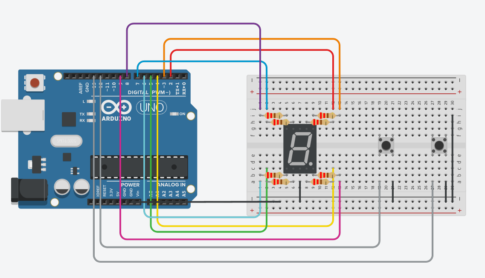

# Number Guess
งานสุด Ez ที่จะทำให้คุณได้ลองเล่น 7-segments display และรู้จักกับ 2d array

## Objective
- ให้ต่อวงจรโดยใช้สวิตช์สองตัว (Guess (G) และ Add (A)) และต่อ 7-segment display จำนวนหนึ่งตัว
- Arduino เริ่มต้นการทำงาน ให้สุ่มคำตอบเป็นเลข 1-9 (แสดงไว้ใน Serial Monitor)
	- เมื่อกดสวิตช์ Add (A) ให้แสดงผลใน 7-segments display เริ่มจาก 1 และเพิ่มขึ้นครั้งละ 1 ถ้าเดิน 9 ให้กลับมาเริ่มที่ 1 ใหม่
	- เมื่อกดสวิตช์ Guess (G) เป็นการทายค่า โดยนำคำตอบใน 7-segments display ไปเปรียบเทียบกับคำตอบ (ค่าที่สุ่มตอนเริ่มการทำงาน)
	- ถ้าคำตอบเท่า ให้ 7-segments display แสดงเป็น "0" ถ้าคำตอบน้อยกว่าให้แสดงเป็นรูป "L" และ ถ้าคำตอบมากกว่าให้แสดงเป็นรูป "Γ"
- สามารถทายได้ไม่จำกัด ถ้าทายถูกให้เริ่มสุ่มคำตอบใหม่
- ให้กำหนดรูปแบบการแสดง 7-segments display เป็นตัวแปร Array แล้วแสดงผลในฟังก์ชัน Loop (ห้ามใช้ if-else หรือ switch-case ในการแสดงผลตัวเลข)

## Circuit Diagram
