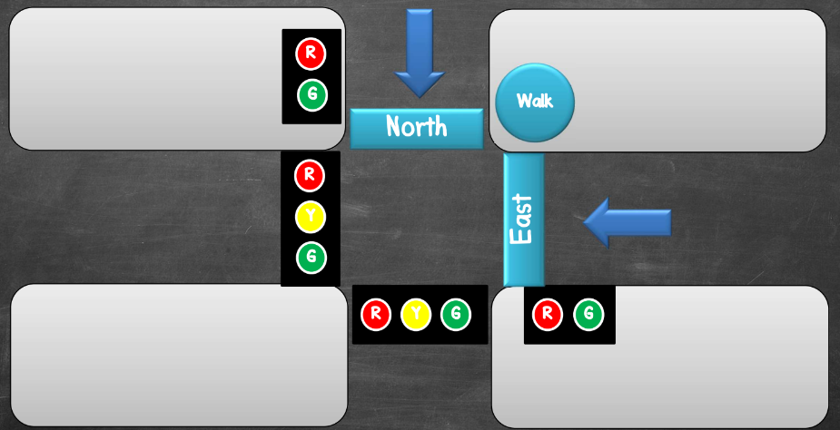

# Traffic Light
เราจะได้ทดลองออกแบบระบบควบคุมไฟจราจรอัจฉริยะโดยใช้หลักการของ Finite State Machine ซึ่งเรื่องนี้มีออกข้อสอบ Final ด้วยนะ

## Objective
ให้สร้างระบบจำลองไฟจราจร 4 แยก แบบ one-way (S -> N & W -> E)

- กำหนดให้มี 3 Inputs ได้แก่ 2 Car Sensors และ 1 Switch สำหรับคนข้าม
- ข้อกำหนด คือ
	- ต้องไม่มีไฟเหลืองหรือเขียวพร้อมกันสองทาง (ไฟคนข้ามทุกแยกให้เป็นสัญญาณเดียวกัน)
	- ถ้ารถวิ่งในทิศทางหนึ่ง ในอีกทิศทางต้องเป็นไฟแดง
	- หากไฟคนข้ามทำงาน ไฟรถต้องแพดงทั้งสองทิศทาง (ไฟคนข้ามทุกแยกให้เป็นสัญญาณเดียวกัน)
	- ทางคนข้ามต้องมีการกระพริบไฟเตือนว่าใกล้จะไฟแดงแล้ว โดยกระพริบติด-ดับ 3 ครั้ง
	- หลังจากไฟเหลืองเตือน หรือกระพริบเตือน ต้องเปลี่ยนเป็นไฟแดง
	- ถ้าไม่มีการกดจะค้างสถานะเดิม
	- ถ้าทุกทางมีรถ/คน ทั้งหมด จะวนไฟเขียวสลับไปทางอื่น
	- เวลาในแต่ละ State ให้กำหนดได้เองตามความเหมาะสม
- ให้ใช้ delay ในโปรแกรมจาก Wait time ของ State เท่านั้น ห้ามใช้ delay() หรือ millis() ในการกระพริบไฟคนข้าม

## Diagram
