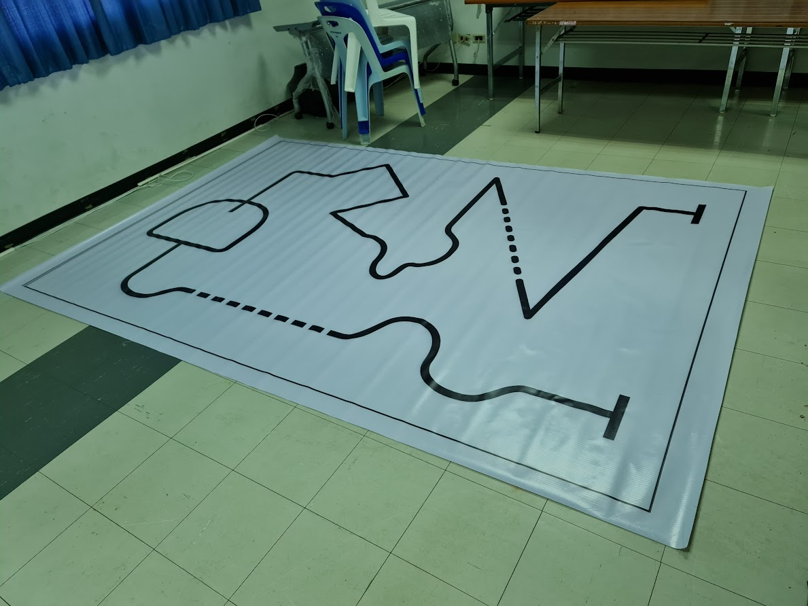

# Robot Car Contest
งานที่เปรียบเสมิอนนรกบนพื้นผิวดิน โปรดเตรียมใช้ชีวิตอยู่ห้อง 811 เป็นเวลากว่า 24 ชั่วโมง

## Objective
สร้าง Robot Car แล้วต่อวงจรเชื่อมกับบอร์ด Arduino และส่วนอื่น ๆ (เฉพาะอุปกรณ์ที่ให้ไป) แล้วเขียนโปรแกรมให้ทำงาน ดังนี้

- สามารถเดินตามเส้นตรง เส้นโค้ง มุม และเส้นประได้
- สามารถหยุดรอสัญญาณไฟตรงแยก เพื่อเลี้ยวตามสัญญาณไฟ
	- กระพริบ 1 ครั้ง ไปทางซ้าย
	- กระพริบ 2 ครั้ง ไปทางขวา
- การควบคุม Robot Car เป็นแบบอัตโนมัติ เริ่มทำงานด้วยสวิตช์เปิด-ปิด มีความมั่นคง อยู่ในจุดที่ใช้งานง่าย
- การ Wire สาย จัดให้เรียบร้อย เพื่อจะไม่เกิดปัญหาหลุด พันกัน เป็นต้น

## Map
สนามที่ใช้ในการแข่งขัน เป็นดังนี้

 
 ## Grading
 คะแนนเต็ม 15 คะแนน โดยมีเกณฑ์การให้คะแนน ดังนี้
 - การให้คะแนนตามจุด Checkpoint หากผ่านแต่ละจุด Checkpoint ต่อไปนี้ได้ จะได้จุดละ 2.5 คะแนน รวม 10 คะแนน
	 - จุด A : ตั้งแต่เริ่มต้น จนถึงจุดรอสัญญาณไฟแดง
	 - จุด B : ผ่านจุดรอสัญญาณไฟทั้งสองจุด (Robot Car ต้องสามารถผ่านได้ทั้งสองจุดจึงจะถือว่าได้ Checkpoint)
	 - จุด C : หลังจุดสัญญาณไฟถึงมุมกลับตัว (โค้งมรณะ 30 - 40 องศา)
	 - จุด D : เส้นชัย (โดย Robot Car ต้องหยุดเมื่อถึงเส้นชัยด้วย)
- สามารถขอ Retry ได้ 3 ครั้ง โดยแต่ละครั้งจะเสียคะแนน 1 คะแนน
- หาก Robot Car ข้ามจุด Checkpoint ด้วยตัวเอง การให้คะแนน ขึ้นอยู่กับดุลยพินิจของกรรมการ
- คะแนน Hardware และ Report 5 คะแนน