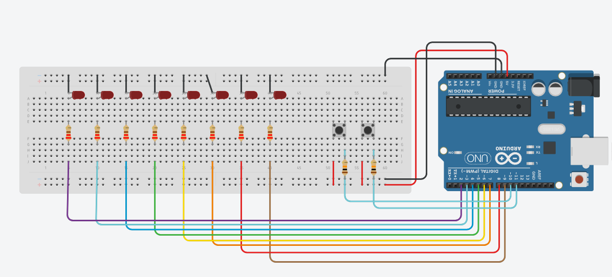

# Accessories / อุปกรณ์ที่มีให้
แต่ละคนจะได้อุปกรณ์คนละ 1 ชุด มีรายการอุปกรณ์ ดังนี้  
| \#  | Name                                             | Quantities|
| :-: | ------------------------------------------------ | :-------: |
|  1  | Arduino Uno R3 + USB Connector                   |     1     |
|  2  | Breadboard                                       |     1     |
|  3  | Jumper Wire                                      |    A lot  |
|  4  | 220 Ohm Resistor                                 |     8     |
|  5  | 10k Ohm Resistor                                 |     4     |
|  6  | Push Button (ปุ่มธรรมดา)                           |     2     |
|  7  | Red LED                                          |     8     |
|  8  | Computer                                         |     1     |

# Requirement
ให้นักศึกษาต่อวงจรโดยใช้ Arduino Uno R3 โดยมีรายละเอียดดังนี้
- ให้ต่อวงจรโดยมี LED 8 ดวง โดยที่ LED แต่ละดวง ต้องต่อกับตัวต้านทานที่มีค่าเหมาะสม โดย LED แต่ละดวงแทนค่าบิต (ปิด แทนบิต 0 / เปิด แทนบิต 1) โดยให้ LED ด้านซ้ายสุด เป็น MSB
- ในตอนเริ่มต้นให้ LED ทุกดวงดับ เพื่อรอรับค่า
- ให้มีปุ่ม 2 ปุ่ม โดยต่อในรูปแบบ PULLUP หรือ PULLDOWN ก็ได้ (ห้ามต่อโดยใช้ Internal Pullup) โดยให้เมื่อกดปุ่มแล้วมีสถานะเป็น HIGH และเมื่อปล่อยปุ่มแล้วมีสถานะเป็น LOW
- ให้เขียนโปรแกรม โดยรับข้อมูลครั้งละ 1 บิต โดยข้อมูลที่รับมาจากการกดปุ่มด้านซ้าย (กด เป็น 1 / ไม่กด เป็น 0) และเมื่อกดปุ่มด้านขวา (ครั้งเดียวเท่านั้น) ให้บันทึกค่าเก็บไว้ในตัวแปร Integer โดยเริ่มบันทึกจาก MSB -> LSB จนครบ 4 บิต จากนั้น ให้นำข้อมูลที่รับได้ แสดงบน Serial Monitor และนำมาแสดงผลใน LED 4 ดวงด้านขวา ค้างไว้ 1 วินาที
- จากนั้น เขียนโปรแกรมให้ LED แสดงผลคูณสะสม* จากตัวเลข Input ไปเรื่อย ๆ (แสดงผลใน Serial Monitor ทุกครั้ง) จนกว่าผลคูณจะมากกว่า 255 แล้วจึงให้แสดงผลหารสะสม** จนกว่าผลลัพธ์จะน้อยกว่าหรือเท่ากับตัวเลข Input
- ให้แสดงผลคูณสะสม และผลหารสะสม วนไปเรื่อย ๆ จนครบ 3 ครั้ง แล้วรอรับ Input ถัดไป

# Test Case
CASE 1: 
  Input = 5  
  Output = (5 -> 10 -> 20 -> 40 -> 80 -> 160 -> 80 -> 40 -> 20 -> 10 -> 5) x3 ครั้ง ------ ให้นำไปแสดงบน LED ในรูปแบบเลขฐานสองด้วย 

CASE 2: 
  Input = 15 
  Output = (15 -> 30 -> 60 -> 120 -> 240 -> 120 -> 60 -> 30 -> 15) x3 ครั้ง ------ ให้นำไปแสดงบน LED ในรูปแบบเลขฐานสองด้วย 

# Warning 
ต้องกดปุ่มขวาก่อน ถึงจะเริ่มรับข้อมูล (ข้อมูลที่จะรับไปเก็บคือสถานะของปุ่มทางซ้าย) เช่น 
ครั้งที่ 1: กดซ้ายค้างไว้ -> กดป่มขวา จะบันทึก 1 _ _ _ 
ครั้งที่ 2: กดปุ่มขวา ไม่กดปุ่มซ้าน    จะบันทึก 1 0 _ _ 
ครั้งที่ 3: กดซ้ายค้างไว้ -> กดป่มขวา จะบันทึก 1 0 1 _ 
ครั้งที่ 4: กดซ้ายค้างไว้ -> กดป่มขวา จะบันทึก 1 0 1 1 
เมื่อครบ 4 บิตแล้ว ให้นำตัวเลขมาแสดงผลใน Serial Monitor และหลอด LED 

# Disclaimer
- ข้อมูลนี้เกิดจากกการที่นักศึกษาช่วยกันจำข้อสอบออกมา อาจไม่ได้ถูกต้อง 100% แต่ยังคงใจความสำคัญของข้อสอบไว้เช่นเดิม
- ใช้เพื่อการศึกษาเท่านั้น

# Circuit Diagram
